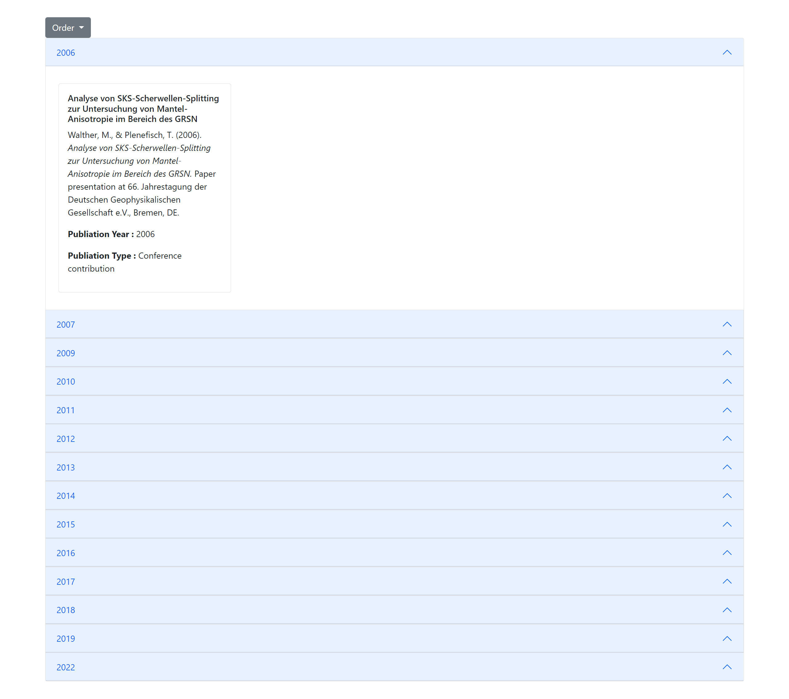
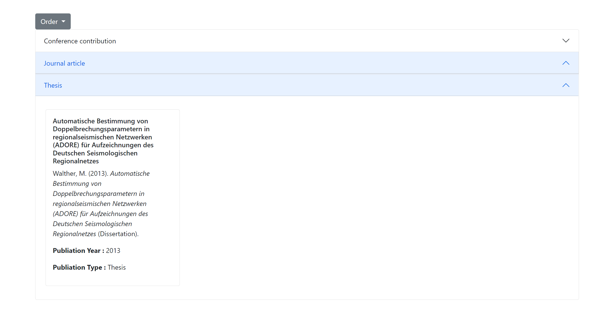

# FAU_API_TASK

FAU Competence Unit for Research Data and Information (CDI) Student Assitance task.

# Features

1.  I am listing all quotationAPA data on order or year on default
2.  It had order filter which group by order all the data where order have two option one is year and other is publication type.
3.  I had used bootstarp to show the data

# Default Listing Output

# Group By Publication Output

